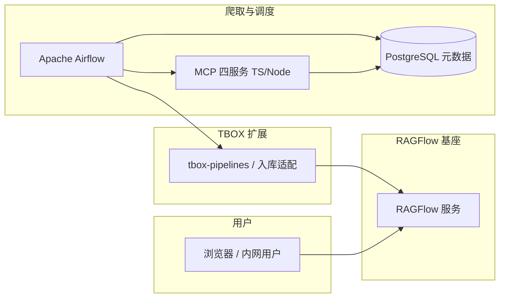

# 02 概要设计（架构与模块边界）

> **当前阶段**：S0 — 仅描述工程壳与后续模块占位  
> **权威基线**：[TBOX-RAGFlow-知识库项目基线与Harness约定.md](./TBOX-RAGFlow-知识库项目基线与Harness约定.md)

## 1. 逻辑架构（占位）

## 2. 仓库与目录边界（与当前工程一致）

| 区域 | 职责 |
|------|------|
| `upstream/ragflow/` | RAGFlow 上游源码（fork / 同步） |
| `apps/ragflow-server/overlay/` | 对 RAGFlow 运行镜像的差量覆盖 |
| `packages/tbox-pipelines/` | 爬取入库、API 封装、批处理（与 Airflow DAG 衔接） |
| `deploy/` | 对外 Docker Compose 与示例环境变量 |

## 3. 待 S1+ 补齐

- 五类角色 × 能力矩阵（基线第 6 节、文档第 18 节）  
- 多数据集 ID 与配置策略（基线第 4.1 节）  
- 告警渠道具体实现（基线第 4.2 节）

## 变更记录

| 日期 | 说明 |
|------|------|
| 2026-04-28 | 初稿：S0 占位 |
